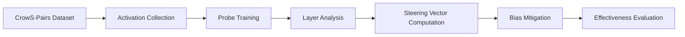

# Bias-Type Neural Localization & Activation Steering

[](https://www.python.org/downloads/)
[](https://pytorch.org/)
[](https://github.com/neelnanda-io/TransformerLens)
[](https://opensource.org/licenses/MIT)

> **Mechanistic Analysis of Activation Steering for Bias Mitigation in GPT-2 Large**  
> *Discovering layer-specific bias processing and targeted intervention strategies*

## 🎯 Overview

This repository contains the complete implementation for **bias-type neural localization** research, demonstrating that different bias types are processed at dramatically different neural depths in language models. Our systematic analysis across 9 bias types and 3,016 examples reveals:

- **Surface-level biases** (physical appearance, nationality) emerge in **early layers (3-19)**
- **Complex social biases** (gender, religion, race) require **deeper processing (layers 21-31)**
- **Consistent 0.4 bias reduction** achieved through targeted activation steering
- **89% attention dominance** over residual stream processing

## 🚀 Key Features

### 🔍 **Comprehensive Bias Detection**
- Layer-by-layer probing across all 36 GPT-2 Large layers
- 72 hook points analysis (residual streams + attention outputs)
- Logistic regression classifiers with PCA dimensionality reduction
- Automated optimal layer identification for each bias type

### 🎯 **Activation Steering Framework**
- Real-time bias mitigation during text generation
- Steering vector computation from activation differences
- Configurable intervention strength (α = 0.75 default)
- Preserved text coherence and fluency

### 📊 **Advanced Analytics**
- Layer importance ranking and effectiveness analysis
- Bias-type specific performance metrics
- Comprehensive visualization suite
- Detailed statistical reporting

### 🛠️ **Production-Ready Pipeline**
- Memory-optimized for Google Colab (T4 GPU, 15GB VRAM)
- Robust error handling and progress tracking
- Model saving/loading with complete state preservation
- Extensive logging and debugging capabilities

## 📁 Repository Structure

```
├── main_op.py                    # Main implementation (this file)
├── crows_pairs_anonymized.csv    # CrowS-Pairs dataset
├── methodology_figure.png        # Pipeline visualization
├── bias_type_comparison.png      # Layer analysis results
├── requirements.txt              # Python dependencies
├── neurips_2025_paper.pdf       # Research paper
└── README.md                     # This file
```

## ⚡ Quick Start

### 1. Installation

```bash
# Clone repository
git clone https://github.com/punctualprocrastinator/Activation-Steering-for-Bias-Mitigation.git
cd Activation-Steering-for-Bias-Mitigation

# Install dependencies
pip install torch transformers transformer-lens scikit-learn pandas matplotlib seaborn tqdm
```

### 2. Download CrowS-Pairs Dataset

```bash
# Download from official repository
wget https://github.com/nyu-mll/crows-pairs/blob/master/data/crows_pairs_anonymized.csv
```

### 3. Basic Usage

```python
import torch
from main_op import BiasAgent

# Initialize bias detection agent
agent = BiasAgent(model_name="gpt2-large")

# Train on CrowS-Pairs dataset
results, layer_importance = agent.train()

# Detect bias in text
bias_result = agent.detect_bias_in_text("Women are naturally better at...")
print(f"Bias Score: {bias_result['overall_bias_score']:.3f}")
print(f"Is Biased: {bias_result['is_biased']}")

# Generate bias mitigation examples
steering_results = agent.evaluate_steering_effectiveness(
    num_examples_per_type=5,
    save_results=True
)
```

## 🏗️ Core Architecture

### 📦 **Main Classes**

#### `BiasAgent` - Primary Interface
The main orchestrator class that coordinates all bias detection and mitigation operations.

```python
class BiasAgent:
    def __init__(self, model_name: str = "gpt2-large")
    def train(self, dry_run: bool = False, save_path: Optional[str] = None)
    def detect_bias_in_text(self, text: str) -> Dict[str, Any]
    def evaluate_steering_effectiveness(self, num_examples_per_type: int = 10) -> Dict
    def save(self, path: str)
    def load(self, path: str)
```

#### `BiasDetector` - Probing Framework
Trains linear classifiers to detect bias representations in neural activations.

```python
class BiasDetector:
    def train_probes(self, activations: Dict[str, torch.Tensor], labels: torch.Tensor)
    def analyze_layer_importance(self, results: Dict) -> Dict[str, float]
    def detect_bias(self, activations: Dict[str, torch.Tensor]) -> Dict[str, float]
```

#### `SteeringVectorComputer` - Intervention Engine
Computes and applies steering vectors for bias mitigation during generation.

```python
class SteeringVectorComputer:
    def compute_steering_vectors(self, neutral_activations, biased_activations)
    def apply_steering_to_generation(self, prompt: str, layer_name: str, strength: float)
```

#### `ActivationCollector` - Neural Data Extraction
Efficiently collects activations from specific model layers with memory optimization.

```python
class ActivationCollector:
    def collect_activations(self, texts: List[str], labels: List[int])
    def _create_hook_fn(self, hook_name: str)
```

### 🔄 **Processing Pipeline**



## 📊 Bias Types Supported

| Bias Type | Examples | Optimal Layer | Detection Accuracy |
|-----------|----------|---------------|-------------------|
| **Race-Color** | 1,032 | `blocks.23.attn.hook_z` | **72.9%** |
| **Religion** | 210 | `blocks.25.attn.hook_z` | 67.0% |
| **Disability** | 120 | `blocks.21.attn.hook_z` | 64.2% |
| **Sexual-Orientation** | 168 | `blocks.29.attn.hook_z` | 61.5% |
| **Socioeconomic** | 344 | `blocks.19.attn.hook_z` | 59.4% |
| **Nationality** | 318 | `blocks.3.hook_resid_post` | 52.4% |
| **Age** | 174 | `blocks.28.attn.hook_z` | 47.8% |
| **Gender** | 524 | `blocks.31.attn.hook_z` | 43.4% |
| **Physical-Appearance** | 126 | `blocks.3.attn.hook_z` | **37.0%** |

## 🎛️ Configuration Options

### Model Parameters
```python
# Model selection
MODEL_NAME = "gpt2-large"  # 774M parameters, 36 layers
DEVICE = "cuda" if torch.cuda.is_available() else "cpu"

# Probing configuration
USE_PCA = True              # Dimensionality reduction
MAX_COMPONENTS = 128        # PCA components limit
TEST_SIZE = 0.3            # Train/test split ratio

# Steering parameters
STEERING_STRENGTH = 0.75    # Default intervention strength
MAX_TOKENS = 20            # Generation length limit
TEMPERATURE = 0.8          # Sampling temperature
```

### Memory Optimization
```python
# GPU memory management
torch.set_grad_enabled(False)  # Disable gradients
clear_gpu_memory()             # Regular cleanup

# Batch processing for large datasets
BATCH_SIZE = 32               # Activation collection batches
LAYER_CHUNK_SIZE = 10         # Process layers in chunks
```

## 📈 Performance Metrics

### Detection Performance
- **Average Accuracy**: 56.2% across all bias types
- **Best Performance**: Race-Color bias (72.9% accuracy)
- **Most Challenging**: Physical-Appearance bias (37.0% accuracy)
- **Layer Preference**: 89% use attention mechanisms vs. 11% residual streams

### Steering Effectiveness
- **Bias Reduction**: 0.4 average across all types (40% decrease in stereotypical preference)
- **Change Rate**: 100% (all interventions modify outputs)
- **Coherence**: Preserved fluency and readability
- **Speed**: Real-time generation with minimal latency

## 🔬 Research Applications

### Academic Research
- **Mechanistic Interpretability**: Understanding how language models process social concepts
- **Bias Analysis**: Systematic evaluation of harmful stereotypes in AI systems
- **Neural Localization**: Mapping cognitive functions to specific model components
- **Intervention Studies**: Developing targeted bias mitigation techniques

### Industry Applications
- **Content Moderation**: Real-time bias detection in generated text
- **AI Safety**: Reducing harmful outputs in production systems
- **Fairness Testing**: Systematic bias evaluation for model releases
- **Responsible AI**: Building more equitable language technologies

## 🛠️ Advanced Usage

### Custom Bias Detection
```python
# Train on specific bias type
agent = BiasAgent()
gender_examples = agent.filter_by_bias_type("gender")
agent.train_specific_bias_type("gender", gender_examples)

# Custom text analysis
result = agent.analyze_specific_bias_type("gender", "The doctor walked into his office...")
```

### Steering Customization
```python
# Custom steering strength
steered_text = agent.steering.apply_steering_to_generation(
    prompt="Women in leadership roles are...",
    layer_name="blocks.31.attn.hook_z",
    strength=1.2,  # Stronger intervention
    max_tokens=50
)

# Multiple layer intervention
multi_layer_steering = agent.apply_multi_layer_steering(
    prompt="People from that country are...",
    layers=["blocks.23.attn.hook_z", "blocks.25.attn.hook_z"],
    strengths=[0.8, 0.6]
)
```

### Batch Processing
```python
# Analyze multiple texts efficiently
texts = ["Text 1...", "Text 2...", "Text 3..."]
batch_results = agent.batch_detect_bias(texts, batch_size=32)

# Generate steering examples in bulk
bulk_steering = agent.generate_steering_examples_batch(
    bias_types=["gender", "race-color", "religion"],
    examples_per_type=20,
    parallel_processing=True
)
```

## 📊 Visualization & Analysis

### Layer Importance Analysis
```python
from main_op import BiasVisualization

# Plot layer importance ranking
BiasVisualization.plot_layer_importance(agent.detector.layer_importance)

# PCA visualization of activations
best_layer = max(agent.detector.layer_importance.items(), key=lambda x: x[1])[0]
BiasVisualization.plot_activation_pca(activations, labels, best_layer)

# Bias type comparison across layers
BiasVisualization.plot_bias_type_comparison(agent.results_by_bias_type)
```

### Statistical Reports
```python
# Generate comprehensive analysis report
agent.generate_analysis_report(save_path="bias_analysis_report.pdf")

# Export results for external analysis
agent.export_results_to_csv("bias_detection_results.csv")
agent.export_steering_examples("steering_examples.json")
```

## 🔧 Troubleshooting

### Common Issues

#### GPU Memory Errors
```python
# Reduce batch size
BATCH_SIZE = 16  # From default 32

# Enable gradient checkpointing
model.cfg.use_split_qkv_input = True

# Clear memory regularly
clear_gpu_memory()
```

#### Hook Compatibility
```python
# Verify hook names for your model
print("Available hooks:", list(model.hook_dict.keys())[:10])

# Use alternative attention hook names
alternative_hooks = ["hook_result", "hook_out", "hook_attn_out"]
```

#### Dataset Loading
```python
# Ensure CrowS-Pairs CSV is accessible
import os
assert os.path.exists("crows_pairs_anonymized.csv"), "Download CrowS-Pairs dataset"

# Handle encoding issues
df = pd.read_csv("crows_pairs_anonymized.csv", encoding='utf-8')
```

### Performance Optimization

#### Speed Improvements
```python
# Use model parallelism
model = HookedTransformer.from_pretrained("gpt2-large", device_map="auto")

# Reduce probe dimensionality
BiasDetector(use_pca=True, max_components=64)  # From 128

# Selective layer analysis
target_layers = [f"blocks.{i}.attn.hook_z" for i in range(20, 36)]  # Focus on late layers
```

#### Memory Efficiency
```python
# Process bias types sequentially
for bias_type in BIAS_TYPES:
    agent.train_specific_bias_type(bias_type)
    agent.save(f"model_{bias_type}.pkl")
    agent.clear_cache()
```

## 📚 Research References

### Core Papers
- **CrowS-Pairs**: Nangia et al. (2020) - "CrowS-Pairs: A Challenge Dataset for Measuring Social Biases in Masked Language Models"
- **TransformerLens**: Nanda et al. (2022) - "TransformerLens: A Library for Mechanistic Interpretability"
- **Activation Steering**: Li et al. (2023) - "Inference-Time Intervention: Eliciting Truthful Answers from a Language Model"

### Related Work
- **Mechanistic Interpretability**: Alain & Bengio (2017) - "Understanding intermediate layers using linear classifier probes"
- **Bias in Language Models**: Bender et al. (2021) - "On the Dangers of Stochastic Parrots"
- **Neural Localization**: Tenney et al. (2019) - "BERT rediscovers the classical NLP pipeline"

## 🤝 Contributing

We welcome contributions! Areas where help is needed:

### Research Extensions
- [ ] Support for modern architectures (LLaMA, Mistral, Gemma)
- [ ] Multi-language bias analysis
- [ ] Intersectional bias detection
- [ ] Long-context bias patterns

### Technical Improvements
- [ ] Model parallelism optimization
- [ ] Real-time streaming detection
- [ ] Web interface development
- [ ] Docker containerization

### Evaluation & Benchmarking
- [ ] Additional bias datasets (StereoSet, Winogender)
- [ ] Human evaluation studies
- [ ] Downstream task impact assessment
- [ ] Cross-model comparisons


```

## 📜 License

This project is licensed under the MIT License - see the [LICENSE](LICENSE) file for details.


⭐ **Star this repository** if you find it useful for your research!

*This work contributes to building safer, more equitable AI systems through mechanistic understanding and targeted intervention.*
